# Compilers 2021/2022: Test 1 Cheat Sheet

## Compiler Overview

### The frontend

- Scanner
  - Maps character stream into tokens (name and attributes)
- Parser
  - Recognizes context-free syntax and reports error
  - Guides context-free syntax and reports errors
  - Guides context-sensitive ("semantic") analysis (type checking)
  - Builds IR for source program, ie. an AST

### The backend

- Instruction Selection
  - Produce fast, compact code
  - A pattern matching problem
- Register Allocation
  - Have each value in a register when it is used
- Instruction Scheduling
  - Avoid stalls and interlocks

## Lexical Analysis

### Regular expressions
- Lexical patterns form a regular language
- Any finite language is regular
- Recognizable by DFAs

### RE to NFA (Thompson Construction)
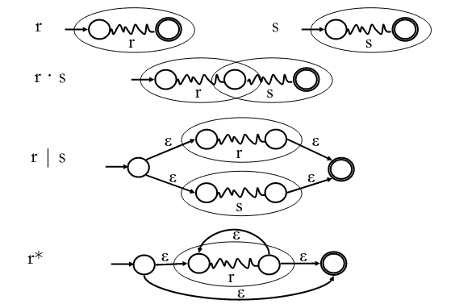

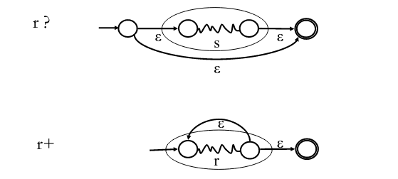

### NFA to DFA (Subset Construction)
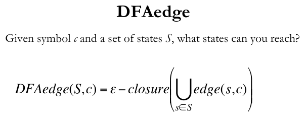

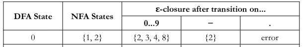

### DFA State Minimization

- Normalization
  - Assure every state has a transition on every symbol
  - Add missing transitions to a trap state
- Algorithm
  - Start with accepting vs non-accepting partitions of states
  - Repartition based on transitions for each symbol: find same partitions for every symbol

### DFA to RE (Kleene Construction)
- The sets that take the DFA from state qi to qj without going through any state numbered higher than k
- When k=0, consider direct transitions
- A dynamic programming approach
  
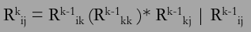

## Syntatical Analysis

### Context free grammars
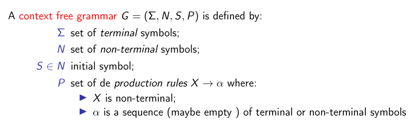

#### Ambiguity
- A grammar producing same word with different syntax tree
- Eliminate forcing priority and/or associativity

### Parsing

### Top-down parsing

#### Recursive descent parsing
- Consume tokens left to right
- Map each none terminal to a function
- Map each production to a different case
- Decide which production to use using the next token

#### LL Parsing
- Recursive descent parsing technique
- LL(k) means: Left-to-right parse, Leftmost derivation, k-symbols lookahed
- Does not support left recursion

##### Left recursion removal
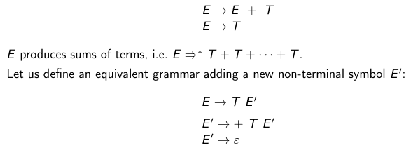

##### LL(1): Predictive parsing
- Sufficient for programming languages
- For each non-terminal symbol, each rule must correspond to a different FIRST set (must left factor rules)
- A parsing table maps non-terminals to input and corresponding rule to choose
- Build the table based on NULLABLE, FIRST and FOLLOW
- Rely on the parsing table and an auxiliary stack to parse input

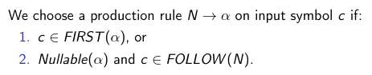

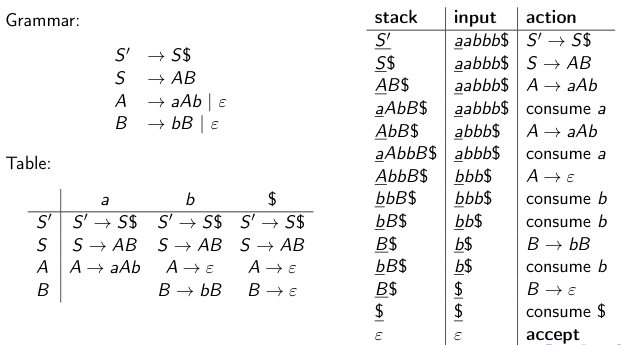

### Bottom-up parsing

#### LR Parsing
- LR(k) means: Left-to-right parse, Rightmost derivation (reversed), k symbols lookahed
- Deals easier with ambiguity and recursion
- Consult the parsing table to parse input using shift, reduce and goto actions
- Read back reductions to get the derivations

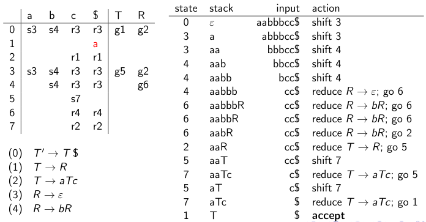

## Semantic analysis

### Lexical scope (static scope)
- Elements usage correpond to the closest declaration in the AST

### Symbol table
- Relates identifiers with semantic information, such as registry location, types and variable values
- Typically implemented with a hash map
- Must represent scopes in some form
  - Open a new scope
  - Close a new scope restoring the previous stack

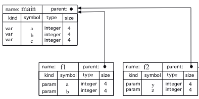

### Type checking
- Assert correct function parameter types, variable attribution types
- Generate more efficient code and avoid errors at run-time

#### Attribute grammars

- Semantic rules for the grammar
- Often implemented with visitor pattern, recursively
- Attributes can be inherited (variable types) or synthesized (types of sub-expressions)

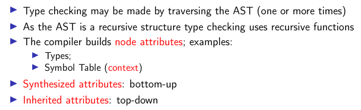

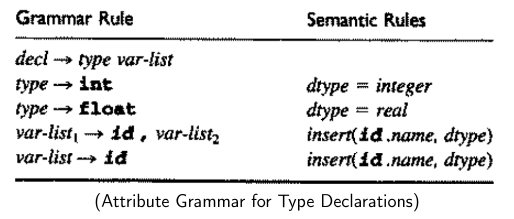